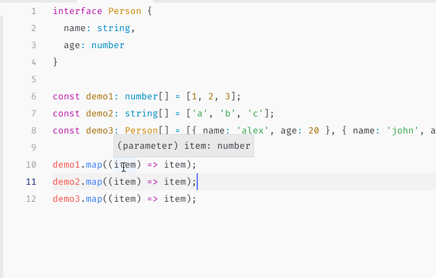

# 62-泛型


这篇文章跟大家分享学习 ts 的又一个重难点「**泛型**」。

在 ts 中，得泛型者，得天下！丢泛型者，失天下！

## 1-什么是泛型

整个 ts 的学习，其实就是各种数据类型的类型约束的学习。当我们规定一个变量只能是 `number` 时，它就不能是其他数据类型。

```typescript
let a: number = 20
a = 'string' // 类型错误
```

在函数中也是一样，传入的参数类型，与返回的参数类型，都会被不同的约束规则约束。

```typescript
function foo(a: number, b: string): string {
  // todo
}
```

当然我们也知道，还可以使用 `interface，type` 定义更为复杂的类型约束。可是这个时候我们就会面临一个问题。

以我们用的非常多的数组方法 `map` 为例。

```typescript
;[1, 2, 3].map((item) => {
  return item + 1
})
```

我们都知道 map 方法接收的第一个参数为一个回调函数 `callback`，`callback`的第一个参数为数组的每一项。那么问题就来了，不同的数组调用 map，数组的每一项数据类型必然不一样

```typescript
;[1, 2, 3].map()[('a', 'b', 'c')].map()
```

应该怎么办？我们应该使用什么样的方式来约束 callback 的参数呢？

简单的使用某一种数据类型来准确的约束数组的每一项肯定是不行的。

这种情况，必须借助「泛型」来帮助我们。

单一的，明确的类型约束理解起来相对简单，可是实践中我们需要对约束稍微放宽一点限制，那么单一的约束就无法满足需求。**泛型，即为更广泛的约束类型**。

仔细观察下面的三组案例，思考一下如果我们要自己描述 Array 类型与数组中的 map 方法应该怎么做？

```typescript
interface Person {
  name: string
  age: number
}

const demo1: number[] = [1, 2, 3]
const demo2: string[] = ['a', 'b', 'c']
const demo3: Person[] = [
  { name: 'alex', age: 20 },
  { name: 'john', age: 10 },
  { name: 'hx', age: 21 },
]

demo1.map((item) => item)
demo2.map((item) => item)
demo3.map((item) => item)
```



从图中可以看出，当不同的数组调用 map 时，回调函数的参数 item，会自动推导为对应的数据类型。也就是说，这里的 item，必然是使用了泛型进行了更为宽松的约束。

**也就是说，泛型，其实就是变量**

是数据类型的变量。

具体如下：

```typescript
interface Array<T> {
  map<U>(callbackfn: (value: T, index: number, array: T[]) => U): U[]
}
```

我们在声明数组类型时，定义了一个泛型变量 `T`。`T` 作为泛型变量的含义为：我们在定义约束条件时，暂时还不知道数组的每一项数据类型到底是什么，因此我们只能放一个占位标识在这里，待具体使用时再来明确每一项的具体类型。

因此针对数据的描述，我们通常可以这样做：

```typescript
const arr1: Array<number> = [1, 2, 3]
const arr2: Array<string> = ['a', 'b', 'c']
const arr3: Array<Person> = [
  { name: 'alex', age: 20 },
  { name: 'john', age: 10 },
  { name: 'hx', age: 21 },
]
```

这里分别定义了三个数组，在约束这些数组时，我们明确了泛型变量`T`的具体数据类型，分别对应为 `number, string, Person`。

那么在描述 map 时的写法就很好理解了。

回调函数 `callbackfn` 的第一个参数就是数组的每一项，正好就是定义数组时传入的泛型变量 `T`，不过回调函数会返回一个新的数组项，因此我们需要重新定义一个新的泛型变量来表达这个新数组，即为 `U`。

```typescript
map<U>(callbackfn: (value: T, index: number, array: T[]) => U): U[]
```

于是我们就使用泛型，准确的描述了 map 方法的含义。

## 2-基础语法

如果完整的理解了泛型的概念，那么泛型的基础知识就比较简单了，过一遍就 OK。

**函数中使用泛型**

```typescript
// 声明一个泛型变量
function identity<T> {}

// 在参数中使用泛型变量
function identity<T>(arg: T) {}

// 在返回值中使用泛型变量
function identity<T>(arg: T): T {}

// 变量声明函数的写法
let myIdentity: <T>(arg: T) => T = identity;
```

**接口中使用泛型**

```typescript
// 使用接口约束一部分数据类型，使用泛型变量让剩余部分变得灵活
interface Parseer<T> {
  success: boolean
  result: T
  code: number
  desc: string
}

// 接口泛型与函数泛型结合
interface Array<T> {
  map<U>(callbackfn: (value: T, index: number, array: T[]) => U): U[]
}
```

**class 中使用泛型**

```typescript
// 注意总结相似性
declare namespace demo02 {
  class GenericNumber<T> {
    private value: T

    public add: (x: T, y: T) => T
  }
}

// 多个泛型变量传入
declare namespace demo02 {
  class Component<P, S> {
    private constructor(props: P)
    public state: S
  }
}
```

## 3-泛型实践场景

**描述数组**

```typescript
interface Array<T> {
  length: number
  toString(): string
  pop(): T | undefined
  // 注意此处的含义
  push(...items: T[]): number
  concat(...items: T[]): T[]
  join(separator?: string): string
  reverse(): T[]
  shift(): T | undefined
  slice(start?: number, end?: number): T[]
  sort(compareFn?: (a: T, b: T) => number): this
  splice(start: number, deleteCount?: number): T[]
  // 注意此处的重载写法
  splice(start: number, deleteCount: number, ...items: T[]): T[]
  unshift(...items: T[]): number
  indexOf(searchElement: T, fromIndex?: number): number
  lastIndexOf(searchElement: T, fromIndex?: number): number
  every(
    callbackfn: (value: T, index: number, array: T[]) => boolean,
    thisArg?: any,
  ): boolean
  some(
    callbackfn: (value: T, index: number, array: T[]) => boolean,
    thisArg?: any,
  ): boolean
  forEach(
    callbackfn: (value: T, index: number, array: T[]) => void,
    thisArg?: any,
  ): void
  map<U>(
    callbackfn: (value: T, index: number, array: T[]) => U,
    thisArg?: any,
  ): U[]
  filter<S extends T>(
    callbackfn: (value: T, index: number, array: T[]) => value is S,
    thisArg?: any,
  ): S[]
  filter(
    callbackfn: (value: T, index: number, array: T[]) => any,
    thisArg?: any,
  ): T[]
  reduce(
    callbackfn: (
      previousValue: T,
      currentValue: T,
      currentIndex: number,
      array: T[],
    ) => T,
  ): T
  reduce(
    callbackfn: (
      previousValue: T,
      currentValue: T,
      currentIndex: number,
      array: T[],
    ) => T,
    initialValue: T,
  ): T
  reduce<U>(
    callbackfn: (
      previousValue: U,
      currentValue: T,
      currentIndex: number,
      array: T[],
    ) => U,
    initialValue: U,
  ): U
  // reduceRight 略
  // 索引调用
  [n: number]: T
}
```

> 列举了几乎所有的数组方法与特性，如果能够从上诉描述文件中掌握如何使用数组方法，那么就表示对于函数，接口，泛型的理解已经比较到位了。如果还不能读懂，则多读几遍

**描述数据返回结果**

约定所有的接口返回满足统一的数据格式。但是具体的可用的数据结果则因为情况不同，会有不同的场景。因此使用泛型先定义一个基本的结构约束。

```typescript
interface Result<T> {
  success: true
  code: number
  descript: string
  result: T
}
```

结合 Promise，当数据返回结果为 number 时

> Promise 本身就需要接受一个泛型变量，因此这里要注意泛型的嵌套使用

```typescript
function fetchData(): Promise<Result<number>> {
  return http.get('/api/demo/number')
}
```

当数据返回结果为普通 JSON 数据时

```typescript
interface Person {
  name: string
  age: number
}

function fetchData(): Promise<Result<Person>> {
  return http.get('/api/demo/person')
}
```

当数据返回为数组时

```typescript
interface Person {
  name: string
  age: number
}

function fetchData(): Promise<Result<Person[]>> {
  return http.get('/api/demo/persons')
}
```

当属返回结果为分页对象时

```typescript
interface Person {
  name: string
  age: number
}

interface Page<T> {
  current: number
  pageSize: number
  total: number
  data: T[]
}

function fetchData(): Promise<Result<Page<Person>>> {
  return http.get('/api/demo/page/person')
}
```

分页对象的返回结果比较复杂，因此描述清楚需要多层嵌套，如果你理解了分页对象，那么基本上泛型就没有什么问题啦！
