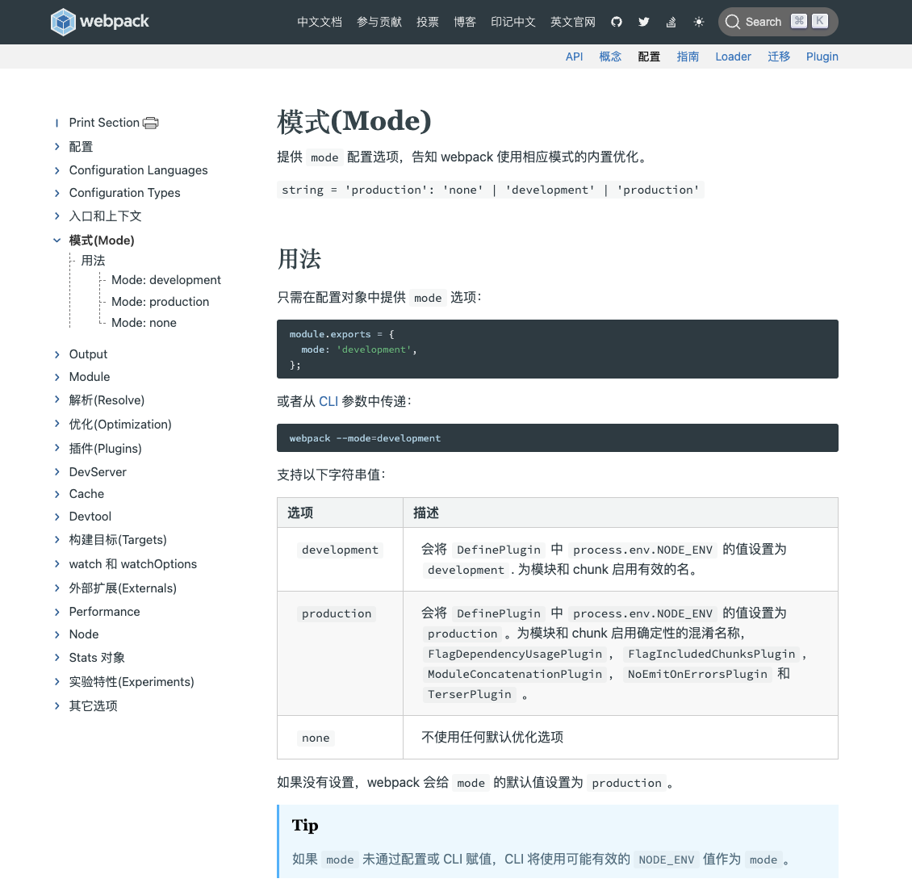
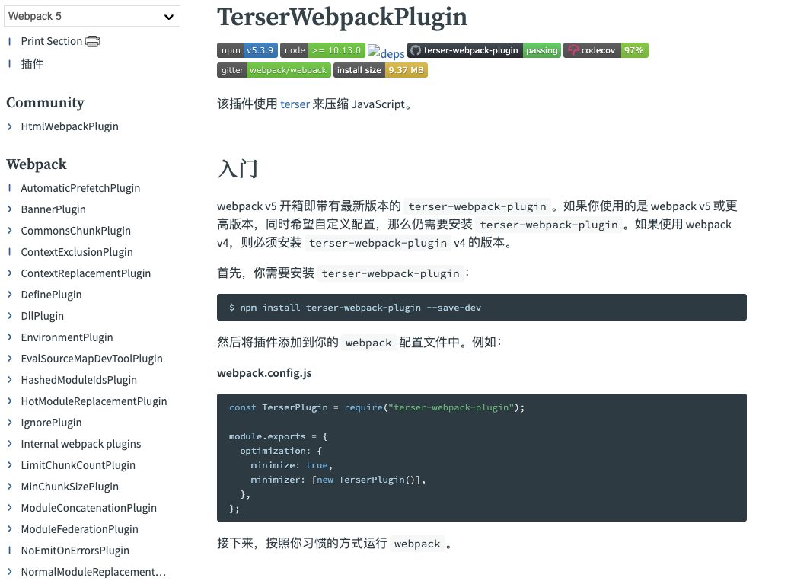

# 06-构建优化(揭开webpack性能优化的内幕)

## 01:webpack的优化配置【了解这些优化配置才敢说会用webpack】

之前我们讲了不少的优化方法，如果都是通过手工去做会非常麻烦，如果可以利用 webpack 这样的构建工具帮我们自动化的完成这些任务，可以大大提高我们的开发效率 可以配置很多 plugins 和 loader 帮我们做很多工作，但我们很难记住所有的 plugins 和 loader，从 webpack4 开始引入了 mode 模式，可以配置开发和生产模式，就可以使用一些已经默认好的插件来帮我们达到一些想做的效果，不用再为这些配置发愁，这也是计算机常用的模式，叫做CONVENTION OVER CONFIGURATION(**约定大于配置**)，它给我们做了两个约定好的模式，我们直接使用就好了，如果这个模式里有些细微的东西我们觉得不太合适，做一些调整，可以重载里面的配置，不用大规模的自己重新进行配置，关于两种模式具体有哪些默认插件可以去官网进行了解




**npm run dev开发模式**


**npm run start生产模式**

> app.bundle.js 少了一半


### Tree-shaking

* 基于ES6 import export 做Tree-shaking有一个基础，无论是你自己的还是引入第三方的，**必须是模块化的**，要基于ES6 import export导入导出的形式才可以，**生产模式默认会启用 Tree-shaking 的功能**，主要是基于它需要依赖的插件 `TerserPlugin`，用来做压缩，实现的简单原理：会根据入口文件，相当于一棵树的根节点，起点，从index.jsx开始，去看它引用了哪些东西，进一步分析所有引入的包或模块里又引用了哪些模块或者其他的一些包，不断分支分支去分析之后，会把所有需要的东西保留下来，把那些虽然我们引用了包里有的东西但我们没有用到的全部给它摇下去，所以最终我们得到的 bundle 只包含了我们代码运行时需要的东西

* package.json 中配置 sideEffects

  > Tree-shaking 虽然很好，但也有它的局限性，它的实现是基于一定的规则，需要基于 es6 的模块化导入导出语法，在 js 里，我们可能会涉及到修改全局作用域，这里全局作用域对于前端或浏览器而言，就是 window 对象，可能在全局上添加了方法或者修改了属性，这个时候是体现不出来的，如果它把你这个 shake 掉了，代码就会出问题，所以它给我们留了后门，就是我们可以指定并告诉 webpack 哪些东西是有副作用的，不能在 Tree-shaking 中去掉

  

* 注意 Babel 默认配置的影响 preset 把常用的 babel 插件做了一个集合，我们调下这个集合就可以用这些插件，转码的时候会把es6模块化的语法转成其他模块化语法，我们希望保留 es6 模块化语法，所以要加上 modules: false 的配置，这样 Tree-shaking 才能起到作用

  

### JS压缩

* Webpack4 后引入 `uglifyjs-webpack-plugin`

* 后来，支持 ES6 替换为 `terser-webpack-plugin`  

  > terser 无论从效率还是效果上都比 uglifyjs 好，所以 terser 后面作为生产模式下默认的压缩插件，而且可以支持 es6语法

* 减小 js 文件体积

### 作用域提升

* 代码体积减小 减少了调用关系逻辑上的代码，把一些函数进行了合并
* 提高执行效率 要进行引用的话，肯定要花时间进行查找，引用进来再进行调用
* 同样注意 Bable 的 modules 的配置 加上modules: false的配置，因为所有这些也要基于es6的import、export的语法

没有启用作用域提升的话，会把这两个模块打成单独的模块，当其中一个依赖到另一个时，会把依赖到的模块 require 进来，再通过 require 进来的模块进行调用

如果启用了作用域提升，会做一个合并，会进行分析，发现有这种依赖调用时，试图把依赖合并到调用里，最终变得更加精简，只有一个函数，当我们使用 **webpack 生产模式时，会自动帮我们做这个作用域提升**

```javascript
/****************** util.js ******************/
export default 'Hello,Webpack';

/**************** index.jsx ********************/
import str from './util';
console.log(str);

/***************** 没有 scope hoisting, webpack 打包后 *******************/
[
  (function (module, __webpack_exports__, __webpack_require__) {
    var __WEBPACK_IMPORTED_MODULE_0__util_js__ = __webpack_require__(1);
    console.log(__WEBPACK_IMPORTED_MODULE_0__util_js__["a"]);
  }),
  (function (module, __webpack_exports__, __webpack_require__) {
    __webpack_exports__["a"] = ('Hello,Webpack');
  })
]
/************************************/

/***************** 有 scope hoisting, webpack 打包后 *******************/
[
  (function (module, __webpack_exports__, __webpack_require__) {
    var util = ('Hello,Webpack');
    console.log(util);
  })
]
/************************************/
```

### Babel的优化配置

* 在需要的地方引入polyfill

  > polyfill 是兼容旧浏览器去进行新的功能或者新的规范的一些实现 给浏览器不支持的语法打补丁，比如 promise、include 等 需要安装@babel/polyfill，安装了这个之后我们就可以兼容这些东西，但这个东西有些过大，把所有涉及到的东西都引入进来了，但我们用到的可能只是其中很小的部分，配置 “useBuiltIns”: "usage" 就可以达到我们的效果

  

* 辅助函数的按需引入

  > 声明了一个class，babel转码后是如下图的形式，使用了_classCallCheck这样的辅助函数，每当我们声明一个新的类时，都会生成这个辅助函数，但这个辅助函数是可以进行复用的，复用可以减少不少的代码，辅助函数的按需引入是对辅助函数的复用，只要把@babel/plugin-transform-runtime插件配置上就可以，剩下工作交给babel做

  

  

* 根据目标浏览器按需转换代码

  > 怎么通过babel设置目标浏览器 要对市场份额超过百分之0.25的所有浏览器都要进行支持，babel就要根据你的配置去决定最后转码要转成什么样，要转成支持你的要求的，如果支持得越少，它要做的转码工作或者转出来的代码体积就越小，但对用户的支持和体验来说是不好的，所以这通常要根据我们的实际情况进行设置

  

  **有哪些可以放在 browers 里进行设置，babel集成的是 browserslist 插件来进行刷选**

  

## 02：webpack的依赖优化【小改动，大作用】

使得webpack打包本身的这个过程可以得到一个提速

[你真的需要 Webpack DllPlugin 吗？](https://www.cnblogs.com/skychx/p/webpack-dllplugin.html)

### noParse（不解析）

* 提高构建速度

* 直接通知 webpack 忽略较大的库

  > 那哪些库可能会被考虑在范围里呢？通常是一些我们引用的第三方的一些类库，或者是一些工具类，他本身到是一些比较大的库，再加上呢它使用的是比较传统的方式，也就是说，没有模块化的方式，去进行编写的，那么他本身也不会有什么外部的依赖，所以这样的库他本身比较独立，又比较大，那我们干脆就不对它去进行解析

* 被忽略的库不能有 import，require，define 的引入方式

  > 那反过来说呢，就是我们被忽略的这些库啊，要有一个特点，就是它不能是模块化的方式去编写的，可以通过去识别一些关键字，像 import，require，define，我们就可以知道这个库是不是这种方式

```javascript
module: {
  noParse: /lodash/,
}
```

### DllPlugin（已被抛弃）

> 把我们经常使用的一些重复的库可以把它提取出来变成一种引用的方式，这样的话我们就不用每一次都对这些库进行一个重新的构建，可以大大的加速我们这个构建的过程
>
> **webpack 4 有着比 dll 更好的打包性能**。所以已不推荐使用了

此处省略。。。

## 03：基于webpack的代码拆分【让网站按需加载】

### 代码拆分做什么

* 把单个bundle文件拆分成若干小 bundles/chunks
* 缩短首屏加载时间

### webpack代码拆分方法

* 手工定义入口

* splitChunks 提取公有代码

  > 拆分业务代码与第三方库
  >
  > 1. 第一个目目就是我们需要把我们的这个代码中重复被使用到的这样的一些东西去提取出来，
  >
  > 2. 第二就是我们要把我们的这个业务逻辑和我们使用的第三方依赖的进行一个拆分，
  >
  > 这是一个很好的一个最佳实践，就是我们要把我们自己的业务和这个业务的依赖去进行一个拆分，因为我们知道我们这个业务可能会经常变，但是第三个库的这些东西可能会经常不变，从缓存这个角度考虑，我们也应该进行一个拆分

  ```json
  optimization: {
    splitChunks: {
      cacheGroups: {
        // 第三方库
        vendor: {
          name: 'vendor',
          test: /[\\/]node_modules[\\/]/,
          minSize: 0,// 最小大小，想把所有依赖的东西都提取出来，变成独立的bundle
          minChunks: 1,// 最少拆成一段
          priority: 10, // 优先级
          chunks: 'initial'
        },
        // 公共的东西
        common: {
          name: 'common',
          test: /[\\/]src[\\/]/,
          chunks: 'all',// all包含了initial，还有个值叫async，异步加载，initial是同步加载，所谓同步异步就是静态或者动态引入组件的方式，all会把静态和动态引入的都考虑在范围内
          minSize: 0,
          minChunks: 2
        }
      }
    }
  },
  ```

* 动态加载

  ```javascript
  import { add } from "./math"
  console.log(add(16, 26))
  
  // 异步加载
  import("./math").then(math => {
    console.log(math.add(16, 26))
  })
  ```

  ```javascript
  import React, { Suspense, lazy } from 'react';
  const Card = lazy(() => import('./Card'));
  class Home extends React.Component {
    render() {
      let cards = [];
      // 多次添加更多的卡片，展示懒加载
      for (let i = 0; i < 100; i++) {
        cards.push(model.map(panel => (
          <Suspense fallback={<div>Loading...</div>}>
            <Card 
            key={panel.name} 
              image={panel.image} 
              title={panel.name}
              route={panel.route} 
         description={panel.body} 
         />
          </Suspense>
        )));
      }
      return (
        <main className={this.props.classes.root}>
          {cards}
        </main>
      );
    }
  }
  ```

## 04：手把手教你做webpack的资源压缩

### 基于 webpack 的资源压缩 Minification

* Terser压缩 js

  > 当webpack启用生产模式时，默认会启动很多的插件，其中包括 Terser

  **terser插件文档**

  [TerserWebpackPlugin](https://webpack.docschina.org/plugins/terser-webpack-plugin/)

  

* mini-css-extract-plugin 压缩 css

  >安装 "mini-css-extract-plugin": "^0.9.0",//样式对象提取到单独文件，css与js进行拆分，拆成两个不同文件，加载时彼此不会影响 "optimize-css-assets-webpack-plugin": "^5.0.3",// CSS压缩优化

  ```javascript
  plugins: [
    new MiniCssExtractPlugin({
      filename: '[name].[contenthash].css',
      chunkFilename: '[id].[contenthash:8].css',
    }),
    new OptimizeCssAssetsPlugin({
      cssProcessorPluginOptions: {
        preset: [
          'default', {
            discardComments: { 
              removeAll: true // 删除注释
            }
          }
       ],
      },
      canPrint: true
    }),
  ]
  ```

* HtmlWebpackPlugin-minify 压缩 HTML

  > [[html-webpack-plugin](https://github.com/jantimon/html-webpack-plugin)]
  >
  > **`minify`**: true` if `mode` is `'production'`, otherwise`false
  >
  > [https://github.com/jantimon/html-webpack-plugin#minification](https://github.com/jantimon/html-webpack-plugin#minification)

  ```json
  {
    collapseWhitespace: true,
    keepClosingSlash: true,
    removeComments: true,
    removeRedundantAttributes: true,
    removeScriptTypeAttributes: true,
    removeStyleLinkTypeAttributes: true,
    useShortDoctype: true
  }
  ```

## 05：基于webpack的持久化缓存【大型企业级应用的必会技能】

利用缓存可以帮我们提高用户在再次访问网站时的体验，加快网页加载速度，如何管理好这些缓存，要保证 html，css，js 都是最新的代码


更新部署过程中，这些资源的更新是有个时间间隔的，有先有后，假如这时用户进行访问，就很容易出现问题，可能拿到最新的 html，但是相关资源未拿到，这时浏览器就会使用之前缓存的 js、css，新的代码和旧的代码一起，会出现问题，该怎么管理好缓存？

### 持久化缓存解决方案

[webpack中hash，chunkhash，contenthash有什么区别](https://zhuanlan.zhihu.com/p/416294253)

* 每个打包的资源文件有唯一的 hash 值

* 修改后只有受影响的文件 hash 变化

* 充分利用浏览器缓存

  > 在所有静态资源后面加一个 hash 值，hash 值可以通过文件内容计算出来，hash 有个特点是离散唯一的值，如果我们文件的内容不变，计算出来的值也不变，而且呢，是唯一的，一旦我们这个文件的内容被修改过了，也就是我们进行了更新，我们要进行再次部署的时候，这个文件所生成的对应的 hash值，也会变化成一个新的值，而且还是唯一的，这样的话，我们就可以做一个增量式的更新，避免我们刚才说的那个问题，即使是在你部署的这个过程中，有这种更新的，这种时间间隔我们也不会出现用户某些文件使用的是新文件，某些使用的是旧的文件，这样就可以充分的利用我们的这个浏览器缓存，还保证用户这种体验的情况下，能够进行一个平稳的更新过度

在我们命名的时候，利用他给我们的这样的一个预置的一个变量，把他它在我们这个文件名里

```javascript
output: {
  path: `${__dirname}/build`,
  filename: '[name].[hash].bundle.js',// 没有进行按需加载的文件的命名规则，整个应用唯一的hash
  chunkFilename: '[name].[chunkhash:8].bundle.js'// 进行按需加载被拆出来的代码打成的包所要进行的命名规则，每个动态组件可能对应若干不同的chunk或者代码段，每个代码端都有自己唯一的hash值，这边用8位的hash值作为命名
},
plugins: [
  new MiniCssExtractPlugin({
    filename: '[name].[hash].css',
    chunkFilename: '[id].[chunkhash:8].css',
  }),
]
```

打出来的包 js 和 css 的 hash 一致


修改成 contenthash 后，打出来的包css和js不一致

```javascript
plugins: [
  new MiniCssExtractPlugin({
    filename: '[name].[contenthash].css',
    chunkFilename: '[id].[contenthash:8].css',
  })
]
```

如果只修改了 js 没有修改css，不会因为 css 是从 js 中提取出来的，而他们使用同个 bundle 值导致文件名也发生变化，因为 css 没发生实质变化，可以保持原有 hash值，这样更新部署时不需要被更新，还可以利用之前的缓存

## 06：基于 webpack 的应用大小监测与分析【webpack性能分析的法宝】

主要是三个工具，那其中前两个工具主要是对我们的这个代码去进行静态分析，然后了解 bundle 里每个模块的体积是什么样的？然后最后一个插件呢，是关注我们速度这块

### 监测与分析

* Stats 分析与与可视化图

  > [http://alexkuz.github.io/webpack-chart/](http://alexkuz.github.io/webpack-chart/)

* webpack-bundle-analyzer 进行体积分析

* speed-measure-webpack-plugin 速度分析

[webpack-chart](https://link.juejin.cn?target=http%3A%2F%2Falexkuz.github.io%2Fwebpack-chart%2F)是 webpack 官网推荐的一个性能分析工具

优点：在线

使用方法：通过webpack --profile --json > stats.json 的命令把我们这个分析的数据导出来，这个数据还是来自于webpack，webpack去进行这个打包的时候，实际上可以给我们去生成这样的一个性能分析的数据文件，它是一个json文件，我们自己看会很麻烦，通过这种可视化的方式让大家更容易去把它读懂，得到这个文件后在这里进行上传，右侧的极坐标图会根据分析的数据进行展示，这个图是自内向外读的，里层的代表的是整个bundle的大小，这个图可以比较清晰的展示每一部分是由什么组成的，可以一层一层的去剖析


上面的工具只能看个大概，还是不够细，想进一步可以用 bundle-analyzer 这样的工具实现，这里用 source-map-explorer，通过这个工具可以进一步进行分析，对 build 里所有的 js 进行分析，这个工具有个特点，首先分析不是基于最后我们的 bundle 文件，而是基于 sourcemap，所以我们需要生成sourcemap

```javascript
//package.json
"scripts": {
  "analyze": "source-map-explorer 'build/*.js'"
},
```

```javascript
// webpack.config.js 
module.exports = {
    mode: 'production',
    devtool: 'hidden-source-map' // 生成sourcemap
}
```

先npm run build 再 npm run analyze，她会很快的帮我们去进行分析，然后打开一个网页给我们展示这个测试的报告，这个报告左上角有一个下拉菜单，我们通过这个去调整，去看具体的某一个bundle，或者这个第一个叫做这个 combined 就是我们所有的 bundle 的一个整体的分析，通过这个很容易了解到我们的每一个包里是什么东西？每块他到底占比怎么样？是不是需要去进行优化？


另外看一下，官方推荐的bundle-analyzer，如果我们使用它去进行这样的类似这个分析的话，也可以得到类似这样的一个可视化的图，他也是通过这种矩形包含的关系去给我们展示这个占比的一个情况，而且他这个这个不同的这个颜色来进行区分，但是我觉得这个图可能跟我们刚才source-map-explorer相比，最大的一个缺点就是他没有把每一部分的这个体积和占比情况直接给我们标出来，看这个图还是有点类似刚刚的在线工具，只能看个大概，但是你去点击具体的部分时，会列出一些具体的内容，仍然没有占比信息，所以推荐使用 **source-map-explorer**


还有个**速度分析**：speed-measure-webpack-plugin

```javascript
const SpeedMeasurePlugin = require('speed-measure-webpack-plugin');

const smp = new SpeedMeasurePlugin();
module.exports = smp.wrap({
 ...
})
```

运行 npm run build，看如下构建日志，可以看到所有 plugins 和所有 loaders 的使用效率情况，会列出具体的工作时总的耗时


## 07：React按需加载的实现方式【中高级前端必会的React按需加载】

* React router 基于 webpack 动态引入
* 使用 Reloadable 高级组件

如何使用 Reloadable 高级组件来做基于路由的按需加载

```jsx
// App.jsx
import loadable from '@loadable/component';
// 使用React-Loadable动态加载组件
const LoadableAbout = loadable(() => import('./About.jsx'), {
  fallback: '<div>loading...</div>'
});
class App extends React.Component {
  constructor(props) {
      super(props);
  }
  render() {
    return (
      <Router>
        <Switch>
          <MuiThemeProvider theme={theme}>
            <div>
              <Header />
              <Route exact path="/" component={Home} />
              <Route path="/about" component={LoadableAbout} />
            </div>
          </MuiThemeProvider>
        </Switch>
    </Router>
    );
  }
}
```

### 总结代码拆分和不同技术的适用场景


代码拆解最初是为了解决我们这一个过大请求的问题，我们知道我们之前是把所有的资源都打成一个包，那么我们通过一个请求，把整个剥去加载到我们的这个首页，那么这个时候他在网络上的这个开销虽然相对的少了一些，因为只有一个请求，但是因为整个包体积比较大，所以他下载耗时非常的长，所以我们就做了一个事情，就是我们这个较大的包进行一个拆解，把它拆成了若干较小的包，这每个小的包只有当其中被用到时才会被加载，这就是**按需加载**，但这也有个问题，就是我们拆解要拆到什么力度，也就是这模块的定义，假如我们是定义到组件的水平，那所有组件都被拆成一个独立模块的话，我们会有很多很多bundle 或者 chunk，每当用到一个组件时就需要进行按需加载，会带来什么问题？我们想要获得这个页面上所有的资源，有若干个组件，就需要发起若干个请求，每个请求都有自己的网络开销，这些网络开销累积起来可能比之前一个请求的开销还大，所以拆解力度要控制好，**通常最合理的方式是按照路由进行按需加载，而当我们页面上的一些组件在不同路由页面会被进行复用时，才把组件单独进行拆解**
