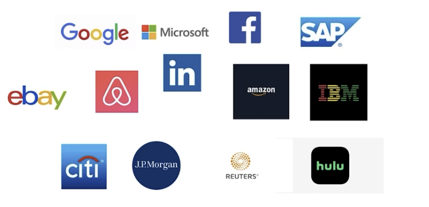

# 10-互联网外企offer与立足之道【能不能出国，就看这一章了】

## 01: 互联网外企offer

### 机会在哪里

### 职业生涯规划

* 技术路线的生命力    
* 工作与生活的平衡    
* 更大的世界

### 面试准备

* 算法/coding、cs基础知识、系统设计、项目经验    
* 英语    
* 沟通与表达

## 02: 英语与工作

### 英语是日常输出    

* 和国外同事一起做项目    
* 和国外同事面对面    
* 在海外工作/出差 

### 怎么学英语    

* 在工作中学习，邮件、电话/视频会议、报告、演示、tb等等    
* 日常积累，背单词？no... √读书、美剧、模仿练习    
* 参加高效的培训